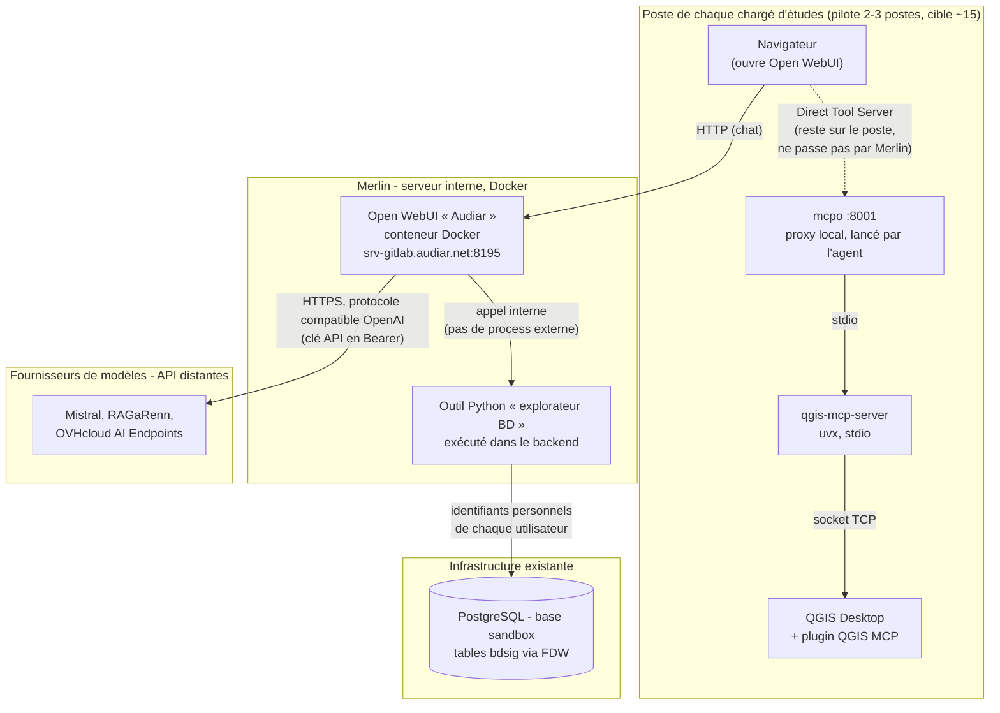

:::: {.bloc-titre}
::: {.typologie}
Décisions d'architecture v0
:::

# Données & outils IA

::: {.sous-titre}
Étude et expérimentations
:::
::::

**Référence** : 2026-HP-INT-001

Décisions techniques (ADR) retenues pour le projet et justifications. Le détail de la recherche comparative qui a nourri ces décisions se trouve dans `benchmark-techno.md` (même dossier).

## Vue d'ensemble

### Principes
Plusieurs principes ont été suivis dans les choix des technologies. Côté fonctionnel, l'analyse a révélé des usages multiples dans l'exploitation des données, associant la plupart du temps plusieurs outils, en particulier QGIS et Excel. Les données peuvent provenir de la base de données de l'Audiar (bdsig), de ses ressources partagées (Z: et K:) ou directement de la source (web, producteur).

Comme indiqué dans l'**analyse technique**, plusieurs critères ont été formulés par le pôle Données pour sélectionner la solution d'orchestration : 

- open source et gratuits ;
- maintenance minimale ; 
- pouvant regrouper le maximum de fonctionnalités au vu des cas d'usages ;
- IA agnostique (n'importe quel fournisseur API peut être utilisé) ;
- gestion des utilisateurs possibles ;
- connexion possibles à des MCP ;
- fiabilité (documentation, pérennité de la technologie)

Plusieurs autres éléments – opportunités ou contraintes –, ont aussi influencé les choix de technologie et les scénarios de développement :

- possibilité de déployer un outil sur un serveur local (Merlin) ;
- compétences en javascript en développement ;
- démarche de montée en compétences en python pour le traitement de données ;
- accès à l'API de RAGaRenn et possibilité de se tourner vers OVH Cloud.
- catalogage de bdsig non terminé ; 
- chantier d'intégrations de données en cours (pôles environnement et habitat-démographie notamment).

::: {.lie}
### Récapitulatif des décisions

Le détail sur les cas d'usages (CU) peut être consulté dans l'analyse fonctionnelle.

| Réf. | Composant | Cas d'usage | Outil retenu | Statut (06/08/2026) | Détail |
|---|-----|----|------|------|--------|
| D-001 à D-004 | Solution d'orchestration | CU1 à CU7 | Open WebUI v0.10.2 | Prototype local et Merlin créés  | Section « Solution d'orchestration » ci-dessous |
| D-008 | Accès base de données | CU1, CU2 et CU4 | outil python | Monté sur Merlin, à optimiser | `fonctionnalites/exploration-bd/README.md` |
| D-007 | Utilisation QGIS | CU5 | MCP local [nkarasiak/qgis-mcp](https://github.com/nkarasiak/qgis-mcp) | Configuré sur Merlin, en test | `guides.md`, section « MCP QGIS (serveur externe) » |
| D-010 | Utilisation Excel | CU3 et CU4 | À l'étude |  |  |
:::

### Index des décisions

Les décisions sont numérotées dans l'ordre où elles ont été prises, et rangées dans le corps du document par thème. Le prochain numéro disponible est donc le dernier de ce tableau, et non la dernière entrée du document.

| Réf. | Décision | Date | Statut |
|---|------|---|---|
| D-001 | Solution prête à l'emploi vs framework | 16/07/2026 | retenu |
| D-002 | Chat/RAG vs mode projet | 16/07/2026 | retenu |
| D-003 | Open WebUI, AnythingLLM ou LibreChat | 16/07/2026 | retenu |
| D-004 | Mode d'installation | 16/07/2026 | retenu |
| D-005 | RAGaRenn : connexion de quatre modèles | 20/07/2026 | retenu |
| D-006 | Mistral : connexion de six modèles | 20/07/2026 | retenu |
| D-007 | QGIS : MCP nkarasiak/qgis-mcp, installé sur chaque poste | 20/07/2026 | retenu |
| D-008 | Base de données : outil Python vers la base sandbox | 03/08/2026 | retenu |
| D-009 | RAGaRenn : ajout du modèle ilaas/gemma-4-31b | 05/08/2026 | retenu |
| D-010 | Excel : dispositif pour la manipulation Excel | 07/08/2026 | proposé |

### Schéma de déploiement

**Légende**  

| Trait | Signification |
|---|---|
| plein | appel HTTP/OpenAPI normal, ou appel interne à Open WebUI |
| tirets fins | Direct Tool Server : l'appel part du navigateur et reste sur le poste |

## Solution d'orchestration

### D-001 — Solution prête à l'emploi vs framework

**Statut** : retenu (16/07/2026)

**Contexte** :

Deux approches possibles pour construire l'outil : une solution prête à l'emploi (peu ou pas de code, cf. benchmark-techno.md section « Solutions prêtes à l'emploi »), ou un framework à assembler soi-même (LangGraph, CrewAI... cf. même fichier, section « Frameworks »), à l'image de l'application de transcription développée par le pôle Données.

**Décision** : 

Solution prête à l'emploi. 

**Options considérées** : 

Le critère « maintenance minimale » a pesé plus lourd que la flexibilité d'un framework, qui fait porter au pôle Données la maintenance dans la durée de tout ce qu'une solution prête à l'emploi peut fournir : gestion des utilisateurs/droits, mémoire/persistance, traçabilité, interface. Construire cela soi-même avec LangGraph (l'un des framework les plus pertinents du comparatif) reviendrait à réimplémenter une partie d'Open WebUI.

**Conséquences** :

*à compléter*

### D-002 — Chat/RAG vs mode projet

**Statut** : retenu (16/07/2026)

**Contexte** :

Les solutions prêtes à l'emploi benchmarkées (cf. `benchmark-techno.md`, même dossier) se répartissent en deux catégories, selon leur orientation : chat/RAG documentaire (AnythingLLM, Open WebUI, LibreChat, Jan, GPT4All) d'un côté, agent autonome/mode projet (Goose, VS Code + Cline, Eigent, Open Cowork, OpenWork, OpenHands) de l'autre. Aucun outil benchmarké n'offre de possibilité sérieuse permettant de combiner ces deux approches.

**Décision** : 

Orientation chat/RAG.

**Options considérées** :

- **Cadrage fonctionnel** : un agent conversationnel avec appel d'outils suffit pour les quatre cas d'usage priorisés (connaissance du catalogue, extraction depuis une table en base,manipulation Excel assistée, géomatique/QGIS) ; seuls les cas 8 et 9 (actualisation d'une chaîne de traitement, conception méthodo), hors périmètre du développement actuel, nécessitent un mode projet (accès autonome à un dossier de travail complet).
- **Profil utilisateur** : les candidats « mode projet » sont pour la plupart pensés pour un profil développeur (VS Code + Cline suppose un éditeur de code ; OpenHands vise des équipes d'ingénierie logicielle) ou restent jeunes et peu documentés (Eigent, pré-v1.0 ; Open Cowork, organisation anonyme et communauté encore petite) ; ils sont moins adaptés à des chargés d'études non-développeurs que les candidats chat/RAG.
- **Maintenance minimale/fiabilité** : plusieurs candidats « mode projet » sont encore jeunes (pré-v1.0, petites équipes) ou dépendent d'un moteur tiers (OpenWork/OpenCode) ; un profil de risque plus élevé que les leaders établis du chat/RAG (Open WebUI, LibreChat), cohérent avec le critère « maintenance minimale » déjà retenu pour écarter les frameworks (cf. section précédente).

**Conséquences** :

Ce choix n'exclut pas le besoin de mode projet identifié pour les cas d'usage 8 et 9 (et potentiellement 7). Le développement d'un prototype pour ces usages sera à évaluer dans un second temps, notamment la piste VS Code + Cline.

### D-003 — Open WebUI, AnythingLLM ou LibreChat

**Statut** : retenu (16/07/2026)

**Contexte** :

La comparaison a d'abord porté sur les trois solutions chat/rag identifiées : Open WebUI, AnythingLLM, LibreChat (cf. `benchmark-techno.md`). Jan et GPT4All ont été écartés car ce sont des applications desktop sans aucun mode serveur/self-hosted documenté, qui impliqueraient une installation et une maintenance individuelles sur chaque poste.

**Décision** : 

Open WebUI (https://openwebui.com/). v0.10.2 installée le 27/07/2026 sur Merlin.

**Options considérées** :

Les trois candidats répondent à plusieurs critères :

- **Souveraineté** : self-hosted, compatible Ollama et tout endpoint API OpenAI pour les trois — cohérent avec la contrainte de sobriété/souveraineté des données.
- **Connexion MCP** : nativement pour AnythingLLM et LibreChat, via le proxy `mcpo` pour Open WebUI (cf. `plateforme/mecanismes-extension.md`).
- **Gestion des utilisateurs** : les trois proposent une forme de multi-utilisateurs.

Ils se différencient selon quatre principaux critères :

- **Multi-utilisateurs et droits (maturité)** : Open WebUI à égalité avec LibreChat (RBAC/SSO matures), nettement devant AnythingLLM (rôles basiques, self-hosted Docker uniquement).
- **Effort de déploiement** : Open WebUI à égalité avec AnythingLLM (un seul conteneur Docker), tous deux plus légers que LibreChat (MongoDB + Redis + MeiliSearch + pgvector).
- **MCP local par utilisateur** : mécanisme « Direct Tool Servers », permettant de répondre au besoin d'utiliser QGIS en mode hybride sur le poste de chaque utilisateur. Mécanisme absent chez AnythingLLM et LibreChat.
- **Extensibilité** : les trois candidats permettent d'ajouter des outils/skills sur mesure au-delà du MCP ; Tools/pipelines en Python pour Open WebUI, skills en JavaScript pour AnythingLLM, actions en JavaScript/TypeScript pour LibreChat. L'objectif du projet portant sur l'exploitation des données, et Python faisant référence dans ce domaine, Open WebUI parait plus opportun.

**Conséquences** :

La licence Open WebUI n'est plus certifiée OSI (Open Source Initiative) depuis la v0.6.6 (BSD 3-Clause + clause de marque), passant de "open source" à "source disponible". Cela ne restreint pas l'usage mais un resserrement du modèle économique du projet (soutenabilité, monétisation possible) est à surveiller. Des discussions de fork ont déjà eu lieu dans la communauté à ce sujet, aucun fork dominant et pérenne ne s'est imposé à ce jour.

### D-004 — Mode d'installation

**Statut** : retenu (16/07/2026)

**Contexte** :

*à compléter*

**Décision** :

Conteneur Docker sur le serveur interne. Une seule instance mutualisée.

**Options considérées** :

*à compléter*

**Conséquences** :

*à compléter*

## Fournisseurs et modèles

### RAGaRenn

#### D-005 — Connexion de quatre modèles

**Statut** : retenu (20/07/2026)

**Contexte** :

*à compléter*

**Décision** :

- mistral-small:latest
- llama-3.3-70b
- gemma-4-31b
- gpt-oss-120b

**Options considérées** :

*à compléter*

**Conséquences** :

*à compléter*

#### D-009 — Ajout du modèle ilaas/gemma-4-31b

**Statut** : retenu (05/08/2026)

**Contexte** :

Erreur sur gemma-4-31b, dû à un problème serveur côté RAGaRenn.

**Décision** :

Ajout du modèle ilaas/gemma-4-31b. gemma-4-31b maintenu dans la liste mais inactif. Liste à jour :

- mistral-small:latest
- llama-3.3-70b
- gemma-4-31b
- ilaas/gemma-4-31b
- gpt-oss-120b

**Options considérées** :

*à compléter*

**Conséquences** :

*à compléter*

### Mistral

#### D-006 — Connexion de six modèles

**Statut** : retenu (20/07/2026)

**Contexte** :

*à compléter*

**Décision** :

- mistral-large-latest
- mistral-medium-latest
- mistral-small-latest
- codestral-latest
- devstral-latest
- mistral-embed

**Options considérées** :

*à compléter*

**Conséquences** :

*à compléter*

## Briques fonctionnelles
Cette section rend compte des dispositifs sélectionnés par chaque besoin. Si un serveur est choisi, le type de configuration, le mode d'installation et de lancement et les versions utilisées seront précisés.

### Utilisation de QGIS

**Cas d'usage** : CU5 (géomatique et cartographie)

**État courant** : `guides.md`, section « MCP QGIS (serveur externe) »

#### D-007 — MCP nkarasiak/qgis-mcp, installé sur chaque poste

**Statut** : retenu (20/07/2026)

**Contexte** :

Vu les usages actuels – avec QGIS comme principal logiciel – et les besoins identifiés, la comparaison a porté sur des dispositifs permettant d'utiliser QGIS en session ouverte, afin de permettre un usage hybride, à la fois manuel et IA.

**Décision** : 

MCP QGIS [nkarasiak/qgis-mcp](https://github.com/nkarasiak/qgis-mcp).

Installé sur le poste de chaque chargé d'étude, jamais centralisé car mode hybride (agit sur le projet QGIS ouvert à l'écran). Chaîne locale : plugin QGIS MCP (socket TCP) → `qgis-mcp-server` (stdio) → `mcpo` local (port 8001).

**Options considérées** :

Deux MCP benchmarkés offrent cette possibilité. Le MCP nkarasiak/qgis-mcp a été retenu pour ses capacités étendues (plus de 100 outils contre environ 15 pour l'implémentation d'origine jjsantos01/qgis_mcp).

**Conséquences** :

*à compléter*

### Accès à la base de données

**Cas d'usage** : CU1 (connaissance des données Audiar), CU2 (extraction de données en base) et CU4 (édition de tables, enrichissement et classifications)

**État courant** : `fonctionnalites/exploration-bd/README.md`

#### D-008 — Outil Python vers la base sandbox

**Statut** : retenu (03/08/2026)

**Contexte** :

Deux bases étaient candidates : bdsig (en lecture seule) et sandbox (accès en écriture dans son schéma individuel). Aucun compte créé spécifiquement pour l'IA n'existe à ce jour.

**Décision** :

Outil / connexion à sandbox avec compte utilisateur.

**Options considérées** :

- serveur MCP configuré globalement avec compte IA / bdsig
- serveur MCP configuré globalement avec compte utilisateur / bdsig ou sandbox
- serveur MCP configuré localement avec compte utilisateur / bdsig ou sandbox
- outil avec compte IA / bdsig
- outil avec compte utilisateur / bdsig ou sandbox

Utiliser un compte créé spécifiquement pour l'IA a l'avantage de sécuriser la base de données, aucun accès en écriture n'étant théoriquement accordé à ce compte. Cependant, ce compte n'existe pas à ce jour, et il restreindrait l'usage des chargés d'études : ils ne pourraient pas écrire dans leur espace sandbox, leur demandant d'importer manuellement les données résultant de leurs requêtes dans cet espace individuel, si les traitements qu'ils mènent sont multiples. Un accès à la base sandbox, avec compte utilisateur, a donc été privilégié, en considérant qu'il permet l'accès à l'ensemble des tables de bdsig (tables distantes via FDW). 

Deux MCP benchmarkés (cf `benchmark-techno.md`) ont été testés, crystaldba et dbhub. Ils proposent des avantages différents : crystaldba intègre des outils d'introspection de schéma et d'analyse de performance ; dbhub propose des options de sécurité (limitations d'usage et chiffrement des connexions réseau TLS/tunnel SSH). Ils ont tous deux été exclus, le premier car il n'est plus maintenu depuis plusieurs mois, avec des tickets ouverts qui s'accumulent ; le second car, outre une dépendance à Node.js, il a montré des limites dans son intégration mcpo/Windows (diverses erreurs de connexions rencontrées, sans résolution). Aussi, ils n'ont pas de plus-value par rapport à un outil en python : celui-ci peut si besoin intégrer introspection de schéma et chiffrement des connexions, les chargés d'études n'ont pas besoin d'analyse de performance, et la sécurité de la base est portée par les droits définis dans Postgres. 

Par ailleurs, utiliser un serveur configuré globalement obligerait à stocker tous les mots de passe individuels dans une configuration gérée par l'administrateur, et une configuration locale doit être répétée chez tous les utilisateurs. Tandis qu'un outil, avec son mécanisme de valves (voir `plateforme/mecanismes-extension.md`), doit être configuré une seule fois par l'administrateur. 

**Conséquences** :

Les utilisateurs n'ont qu'à renseigner, une seule fois, leur id et mot de passe dans les paramètres de l'outil.

Quel que soit le dispositif utilisé, plusieurs risques ou limites exposés dans les analyses fonctionnelle et technique doivent être pris en compte : 
- risque d'erreurs SQL silencieuses (jointure, filtre...) : point d'attention à ajouter dans les guides d'utilisation ;
- base de données pas encore documentée : tests sur tables cibles (base éco, base logement, MOS/Cosia) avec une documentation à créer.

### Utilisation d'Excel

**Cas d'usage** : CU3 (manipulation Excel et traitements de données assistés)

**État courant** : aucun dispositif monté

#### D-010 — Dispositif pour la manipulation Excel

**Statut** : proposé (07/08/2026)

**Contexte** :

Un usage hybride étant attendu (utilisation de l'IA s'ajoute à l'utilisation des outils) et le contrôle des résultats produits étant un enjeu important, la comparaison a notamment porté sur la capacité des outils à interagir en direct dans les documents ouverts par les utilisateurs. 

**Décision** :

*à compléter*

**Options considérées** :

- sous Windows, un fichier `.xlsx` ouvert dans Excel est verrouillé en écriture pour les autres processus ; une tentative d'écriture par openpyxl (ou toute bibliothèque équivalente manipulant le fichier directement) échoue avec `PermissionError` (`WinError 32`) tant que le fichier reste ouvert. Ainsi, les MCP de `haris-musa` et `guillehr2` ne peuvent pas offrir de mode hybride par construction, seule une lecture seule (`read_only=True`) reste possible fichier ouvert, jamais l'écriture.
- ce fonctionnement n'est possible qu'avec le MCP tournant sur la machine de l'utilisateur — approche COM/OLE (`sbroenne`, `negokaz` en mode "Live editing") —, pas de manière centralisée, qui ne permet que l'approche fichier (`haris-musa`, `negokaz` en mode normal, `guillehr2`).

Les fichiers Excel concernés sont des fichiers locaux, sur le poste Windows de chaque chargé d'études. La piste d'une co-édition via Microsoft Graph API (fichier en ligne, co-édition native Excel) est donc écartée d'emblée pour ce prototype.

**Conséquences** :

*à compléter*