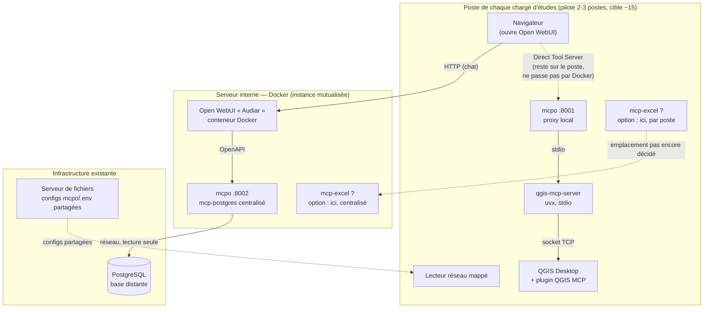

# Schéma de déploiement prod : où tournent les serveurs MCP

Complète `docs/architecture/decisions.md` (qui décide *quel* serveur MCP retenir) par une vue *où chacun tourne physiquement* — cette question diffère par serveur.

## Vue d'ensemble

## Ce qui est tranché

- **Open WebUI ("Audiar")** : conteneur Docker sur le serveur interne. Une seule instance mutualisée à venir (aujourd'hui : poste local de Charlotte).
- **mcp-postgres** : centralisé, sur le même serveur Docker qu'Open WebUI (aucune raison de dépendre du poste d'un agent puisqu'il interroge une base distante) — `mcpo` sur le port 8002, exposé en OpenAPI.
- **mcp-qgis** : sur le poste de chaque agent, jamais centralisé — mode hybride (agit sur le projet QGIS ouvert à l'écran). Chaîne locale : plugin QGIS MCP (socket TCP) → `qgis-mcp-server` (stdio) → `mcpo` local (port 8001).
- **Connexion poste agent ↔ Open WebUI pour mcp-qgis** : mécanisme **Direct Tool Servers** — l'appel HTTP part du navigateur de l'agent directement vers son propre `localhost:8001`, sans repasser par le conteneur Docker. C'est ce qui permet à une instance Open WebUI mutualisée d'atteindre un outil qui tourne sur chaque poste individuellement (cf. `docs/architecture/decisions.md`, section "Connexion des serveurs MCP à Open WebUI").
- **mcp-filesystem** : reporté, aucun cas d'usage ne l'appelle dans le scope actuel — absent du schéma.

## Ce qui reste ouvert

- **mcp-excel** : pas encore monté. Deux emplacements possibles, non tranchés — poste agent (comme QGIS, si les fichiers Excel manipulés sont locaux/sur lecteur mappé propre à chaque agent) ou centralisé sur le serveur Docker (comme postgres, si l'accès se fait via un chemin réseau commun). À trancher une fois le serveur monté et le cas d'usage réel testé.
- **Rôle exact du serveur de fichiers** : sert aujourd'hui à mutualiser des paramétrages entre postes (configs `mcpo`, gabarits `.env`, scripts `start.sh`) plutôt qu'à héberger les fichiers Excel/catalogue eux-mêmes ou des documents RAG — à confirmer/affiner selon l'usage réel une fois plusieurs postes déployés.
- **Supervision des processus `uv`/`mcpo`** sur chaque poste agent (lancement manuel aujourd'hui, à automatiser pour un déploiement à 15 utilisateurs) : cf. `docs/architecture/decisions.md`, section "Point de vigilance : passage à l'échelle".

## Légende

| Trait | Signification |
|---|---|
| plein | appel HTTP/OpenAPI normal |
| tirets fins | Direct Tool Server (reste sur le poste) |
| pointillés | partage de fichiers/config |
| tirets colorés | point non tranché |
