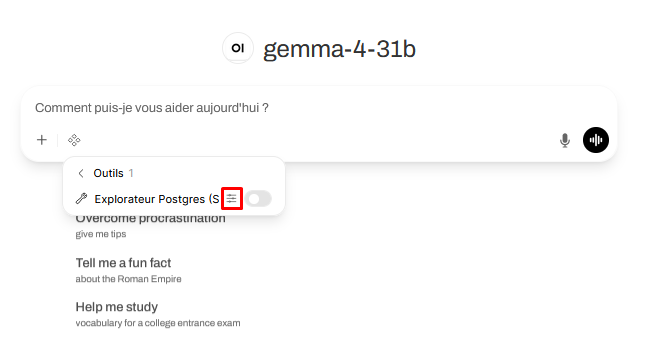
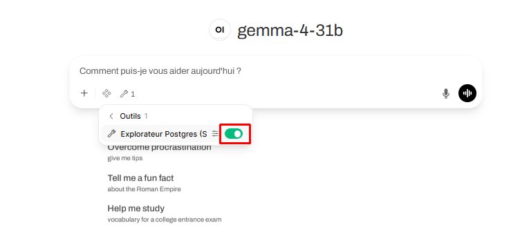
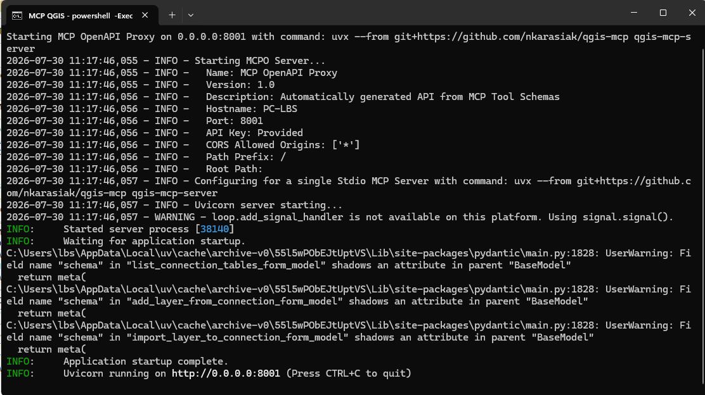

:::: {.bloc-titre}
::: {.typologie}
Notice utilisateur
:::

# Kit de démarrage Open WebUI

::: {.sous-titre}
Guide d'installation et de prise en main
:::
::::

## Démarrage

### Récupérer le dossier [kit-demarrage-openwebui]

Copier le dossier **[kit-demarrage-openwebui]**  de [Z:\3.NUMERIQUE\PROJETS\2026_IA&BD_] sur son PC. Il contient le fichier **`kit-demarrage-openwebui.pdf`** (cette notice d'utilisation) et trois sous-dossiers :  

- **[install]** : programmes d'installation des dépendances pour l'utilisation des MCP locaux  
- **[outils-serveurs]** : fichiers JSON pour configurer les outils et serveurs dans Open WebUI
- **[start-mcp]** : programmes de lancement des MCP locaux

### Se connecter à Open WebUI

1. se connecter à Open WebUI à l'adresse [http://srv-gitlab.audiar.net:8195](http://srv-gitlab.audiar.net:8195) dans le navigateur internet
2. renseigner son adresse mail Audiar et le mot de passe « test » (sans les guillemets)
3. mettre l'application en favori du navigateur

Deux espaces à connaître :  

- les **réglages utilisateurs**, accessible en cliquant sur la bulle « Profil »  
- les **espaces de travail**, où peuvent être importés et configurés différents éléments : des outils (scripts python), des skills (informations supplémentaires envoyées à l'IA), des connaissances (que l'IA peut consulter si besoin)  

## Prendre en main Open WebUI
### Conversations
### Espaces de travail
### Réglages

## Installer et utiliser des outils
Dans Open WebUI, il est possible d'ajouter des « outils » dans son espace de travail. A ce jour, un outil est expérimenté, pour explorer la base de données.

### Explorateur de la base de données Audiar

L'outil est déjà installé (il a été créé par un administrateur et est partagé avec tous les utilisateurs). Il nécessite toutefois un identifiant et un mot de passe à la base de données de l'Audiar.

Ceux-ci doivent être renseignés dans les paramètres utilisateurs de l'outil, accessible depuis une page conversation, après avoir cliqué sur le symbole « Outils » (4 petits losanges).

.

Pour permettre à l'IA d'accéder à la base de données, l'outil doit être rendu actif.

## Installer et utiliser des serveurs locaux
Pour permettre à l'IA de travailler « en direct » dans nos logiciels, il faut installer des serveurs locaux (s'ils sont distants, ils ne peuvent pas trouver notre PC). A ce jour, un serveur est expérimenté, pour utiliser QGIS.

### QGIS

#### Première installation (attention réservé aux geeks)
1. Dans le dossier [kit-demarrage-openwebui], ouvrir  [install] et double-cliquer sur les fichiers **`install-git.bat`** et **`install-uv.bat`** pour installer les deux programmes. Ces installations peuvent prendre plusieurs minutes.
2. Si une autorisation pour utiliser Python est demandée, accepter.
3. Dans QGIS, installer l'extension `QGIS MCP` développée par Nicolas Karasiak. La fenêtre de configuration est destinée aux applications comme Claude desktop, elle peut être fermée.
4. Dans Open WebUI, après avoir avoir cliqué sur la bulle profil en bas à gauche, `Réglages` → `Intégrations` → `Gérer les serveurs d'outils`  → `➕ Ajouter une connexion`.
5. Cliquer sur « Importer » et sélectionner le fichier **`serveur-mcp-qgis.json`** qui se trouve dans le dossier [outils-serveurs] de [kit-demarrage-openwebui]et confirmer.

#### Lancement du MCP
Ces deux étapes devront être respectées à chaque utilisation du MCP de QGIS avec Open WebUI.

1. Dans QGIS, dans le menu `Extensions` → `QGIS MCP`, activer `Run MCP`
2. Dans [start-mcp], double-cliquer sur le fichier **`start-mcp-qgis.bat`** pour lancer le serveur. Cette opération peut prendre plusieurs minutes. Une fois lancé, le terminal PowerShell doit indiquer « Uvicorn running on http://0.0.0.0:8001.
3. Laisser ouvert le terminal, il s'agit de la « porte » entre Open WebUI et QGIS.

#### Utilisation